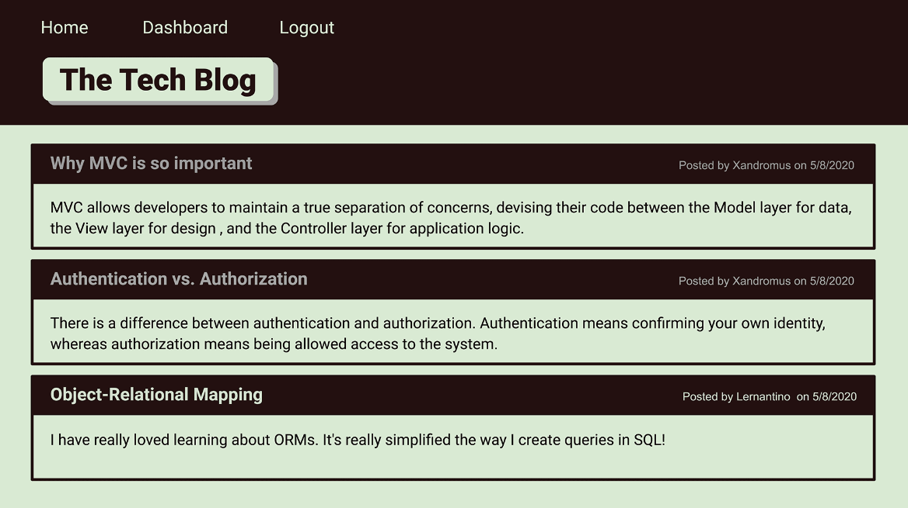

# Tech Blog

## User Story

 

AS A developer who writes about tech
I WANT a CMS-style blog site
SO THAT I can publish articles, blog posts, and my thoughts and opinions

# Acceptance Criteria

GIVEN a CMS-style blog site
 

<ul>
<li>WHEN I visit the site for the first time</li>
<li>THEN I am presented with the homepage, which includes existing blog posts if any have been posted; navigation links for the homepage and the dashboard; and the option to log in</li>
<li>WHEN I click on the homepage option</li>
<li>THEN I am taken to the homepage</li>
<li>WHEN I click on any other links in the navigation</li>
<li>THEN I am prompted to either sign up or sign in</li>
<li>WHEN I choose to sign up</li>
<li>THEN I am prompted to create a username and password</li>
<li>WHEN I click on the sign-up button</li>
<li>THEN my user credentials are saved and I am logged into the site</li>
<li>WHEN I revisit the site at a later time and choose to sign in</li>
<li>THEN I am prompted to enter my username and password</li>
<li>WHEN I am signed in to the site</li>
<li>THEN I see navigation links for the homepage, the dashboard, and the option to log out</li>
<li>WHEN I click on the homepage option in the navigation</li>
<li>THEN I am taken to the homepage and presented with existing blog posts that include the post title and the date created</li>
<li>WHEN I click on an existing blog post</li>
<li>THEN I am presented with the post title, contents, post creator's username, and date created for that post and have the option to leave a comment</li>
<li>WHEN I enter a comment and click on the submit button while signed in</li>
<li>THEN the comment is saved and the post is updated to display the comment, the comment creator's username, and the date created</li>
<li>WHEN I click on the dashboard option in the navigation</li>
<li>THEN I am taken to the dashboard and presented with any blog posts I have already created and the option to add a new blog post</li>
<li>WHEN I click on the button to add a new blog post</li>
<li>THEN I am prompted to enter both a title and contents for my blog post</li>
<li>WHEN I click on the button to create a new blog post</li>
<li>THEN the title and contents of my post are saved and I am taken back to an updated dashboard with my new blog post</li>
<li>WHEN I click on one of my existing posts in the dashboard</li>
<li>THEN I am able to delete or update my post and taken back to an updated dashboard</li>
<li>WHEN I click on the logout option in the navigation</li>
<li>THEN I am signed out of the site</li>
<li>WHEN I am idle on the site for more than a set time</li>
<li>THEN I am able to view comments but I am prompted to log in again before I can add, updated, or delete comments</li>
</ul>

[Tutorial Video](https://placeholder)

Contribution guidelines for this project

